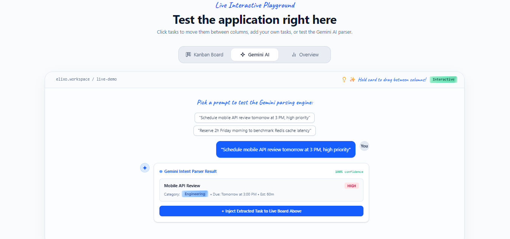
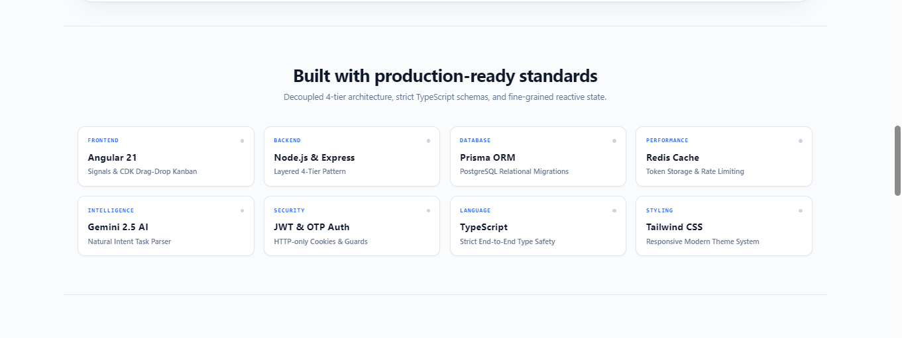
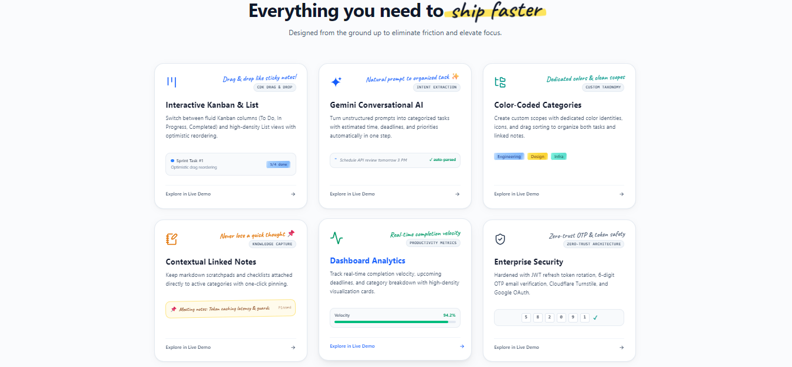
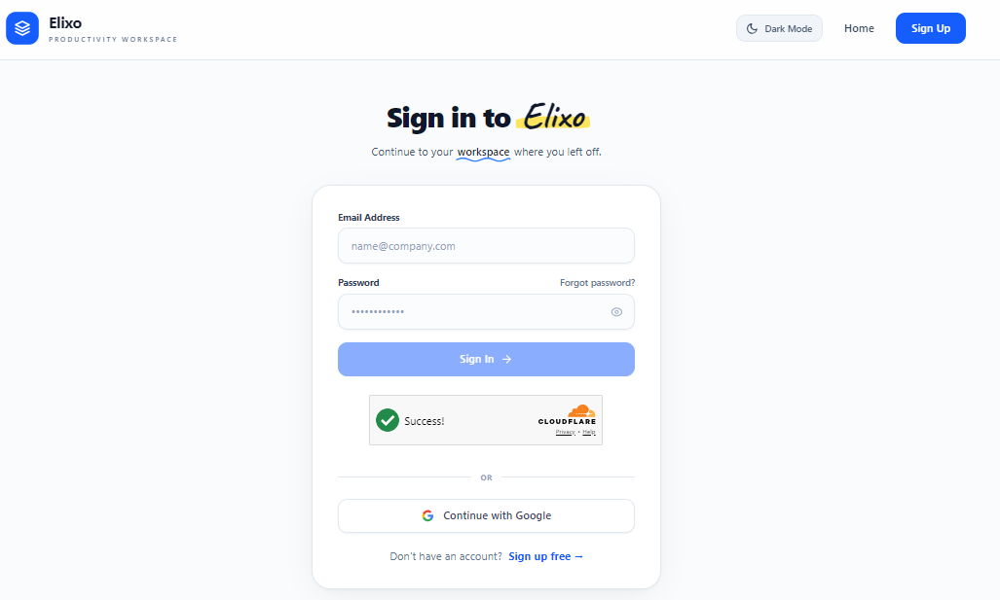
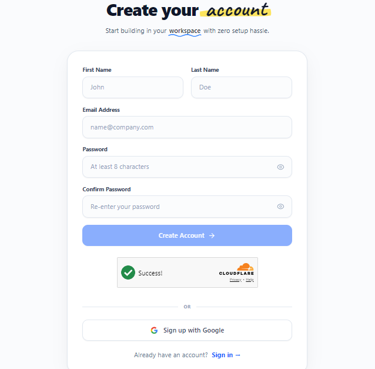
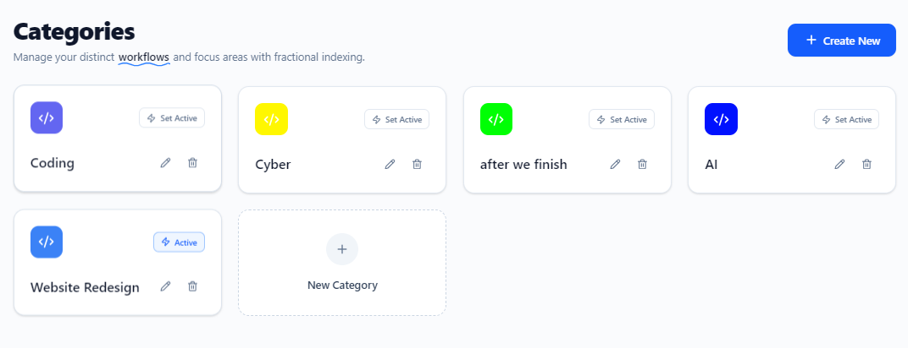
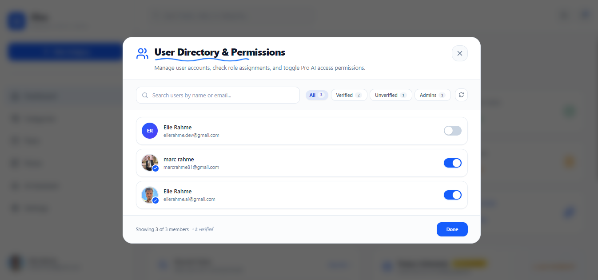
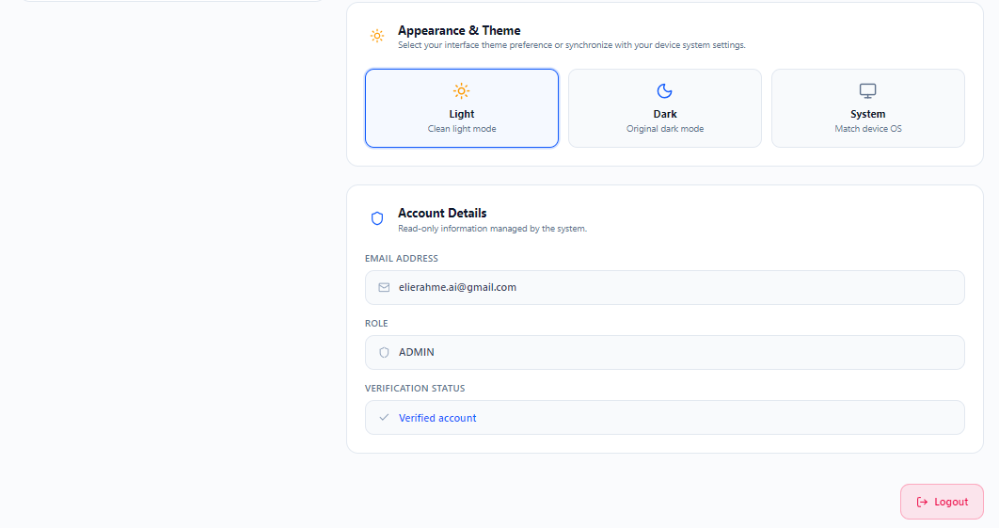

# AI Task Management

AI-powered task management platform built with Angular, Node.js, Express, PostgreSQL, Prisma, Redis, and Gemini AI.

The platform allows users to manage tasks, categories, notes, priorities, statuses, deadlines, and interact with an AI assistant using natural language.

## 📸 Application Screenshots

### 1. Home


The main landing page introducing the Elixo task management platform and its core functionality.

### 2. Kanban Board


The Kanban view provides a visual way to organize tasks according to their current status.

### 3. AI Assistant



The AI-powered interface allows users to manage their productivity through natural-language commands.

### 4. Home Features



Additional information about the platform and its productivity features.

### 5. Home Information



Further details about the application's functionality and user experience.

### 6. Sign In



Users can securely sign in to access their tasks, categories, notes, and personal productivity data.

### 7. Register



New users can create an account and start using the task management platform.

### 8. Dashboard


The dashboard provides an overview of the user's productivity, tasks, categories, and current activity.

### 9. Categories


Users can create and manage categories to organize their tasks and notes.

### 10. Drag and Drop Categories


Categories can be reordered using drag-and-drop interactions.

### 11. Edit Category


Users can modify existing category information directly from the application.

### 12. Tasks


The task management interface allows users to create, view, update, and organize their tasks.

### 13. Drag and Drop Tasks


Tasks can be reordered using drag-and-drop functionality for easier organization.

### 14. Notes


Users can create and manage notes separately from their tasks.

---

## 🤖 AI Assistant

### 15. AI Chatbot


Elixo AI allows users to interact with their productivity data using natural-language commands.

### 16. Create Category, Task and Note


The AI assistant can understand a single request containing multiple actions, such as creating a category, task, and note.

### 17. Create Dashboard Action



The assistant processes user commands and performs the requested productivity actions through the application.

### 18. Create Task


Users can create a task by describing it naturally to the AI assistant.

### 19. Create Note


The assistant can identify note-related requests and create notes separately from tasks.

### 20. Update Priority


Users can change a task's priority using a natural-language command.

### 21. Updated Priority


The assistant confirms and displays the task after its priority has been updated.

### 22. Update Status


Users can change the status of a task through natural-language instructions.

### 23. Updated Task Status


The updated task is displayed after the status change has been successfully processed.

### 24. Update Task Time


Users can request changes to a task's scheduled time using natural language.

### 25. Updated Task Time


The assistant displays the task after its time has been successfully updated.

### 26. Delete Category


The AI assistant can process requests to delete an existing category.

### 27. Category Deleted


The application reflects the category deletion after the operation is completed.

### 28. Admin Dashboard



The admin dashboard provides administrators with an overview and management interface for monitoring and managing the application.

### 29. User Profile


The profile page allows users to view and manage their personal account information.

### 30. Profile Settings



Users can manage and update their profile information through the account settings interface.


## 🛠️ Technologies

* Angular
* TypeScript
* Tailwind CSS
* Node.js
* Express.js
* PostgreSQL
* Prisma ORM
* Redis
* Google Gemini AI
* JWT Authentication
* REST API

## 🤖 AI Architecture

The AI assistant combines rule-based processing with Gemini AI to handle both simple commands and complex natural-language requests.

```text
User Message
     │
     ▼
Input Validation
     │
     ▼
Preprocessing
     │
     ▼
Intent Detection
     │
     ├───────────────┐
     ▼               ▼
Simple Request   Complex Request
     │               │
     ▼               ▼
Rule-Based       Gemini AI
Parser              │
     │               │
     └───────┬───────┘
             ▼
      Action Validation
             │
             ▼
      Application Services
             │
             ▼
           Prisma
             │
             ▼
        PostgreSQL
```

## 🔐 Security

The application includes:

* JWT authentication
* HttpOnly refresh tokens
* Password hashing with bcrypt
* Email verification
* Password recovery
* Google authentication
* Cloudflare Turnstile
* Input validation
* API protection

## 🎯 Project Goal

The goal of Elixo is to provide a modern productivity platform where users can manage their tasks and notes through both a traditional graphical interface and natural-language AI commands.
