# AI Task Management

AI-powered productivity platform that allows users to manage tasks, notes, and categories through a modern interface and a natural-language AI assistant.

## 🚀 Features

* Task management
* Category management
* Notes management
* Kanban task organization
* Task priorities and statuses
* Due dates and time management
* Natural-language AI assistant
* Create, update, complete, and delete operations through AI
* Multi-action AI commands
* JWT authentication
* PostgreSQL database
* Redis integration

## 🛠️ Tech Stack

* **Frontend:** Angular, TypeScript, Tailwind CSS
* **Backend:** Node.js, Express.js
* **Database:** PostgreSQL, Prisma
* **Cache / Temporary Data:** Redis
* **AI:** Google Gemini
* **Authentication:** JWT, HttpOnly Cookies, bcrypt
* **Deployment:** Render

---

# 📸 Screenshots

## 🏠 Home Page

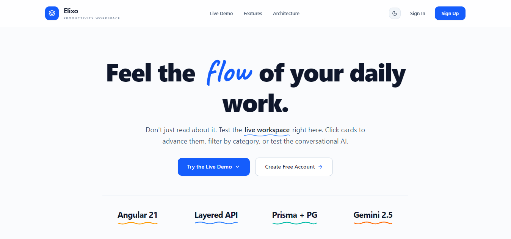

The home page provides an overview of the application and introduces the main productivity features.

---

## 📊 Dashboard

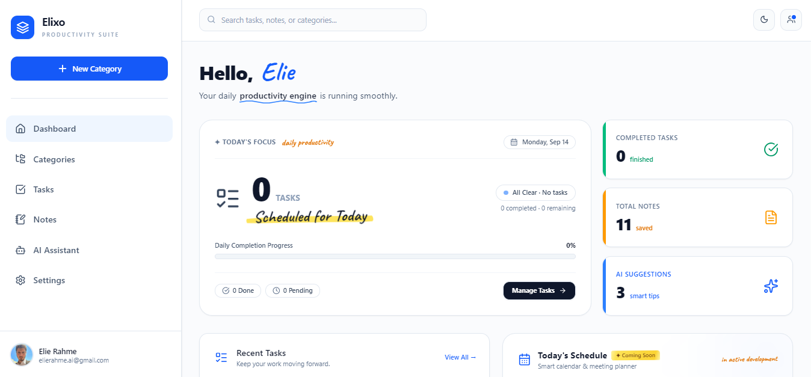

The dashboard gives users a central view of their tasks, categories, and productivity information.

---

## 📋 Kanban Board

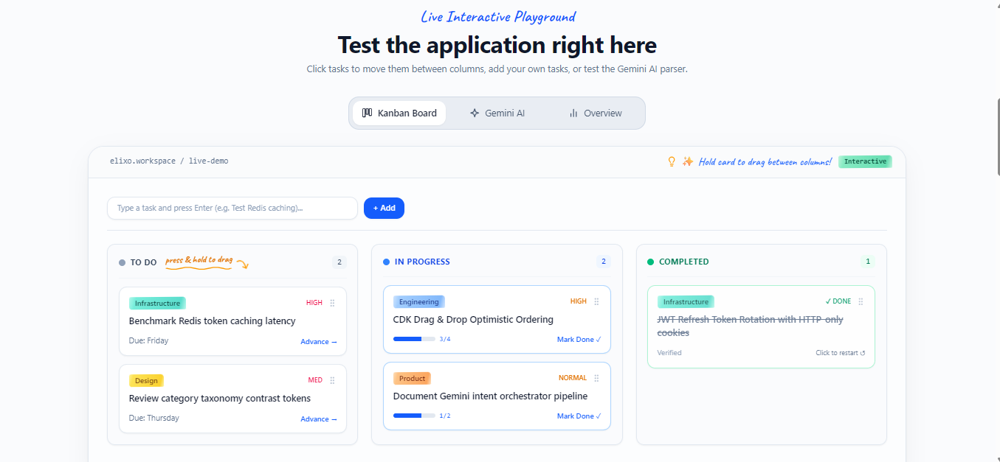

The Kanban board allows users to organize tasks visually and move them between different workflow states.

---

## 🗂️ Categories

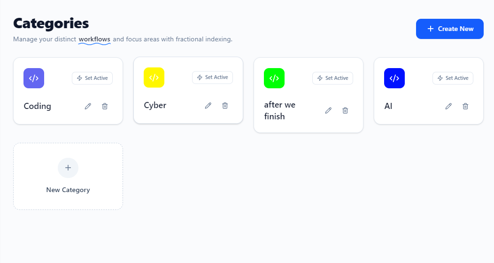

Users can create and organize custom categories to keep their tasks and notes structured.

---

## 🖱️ Drag and Drop Categories

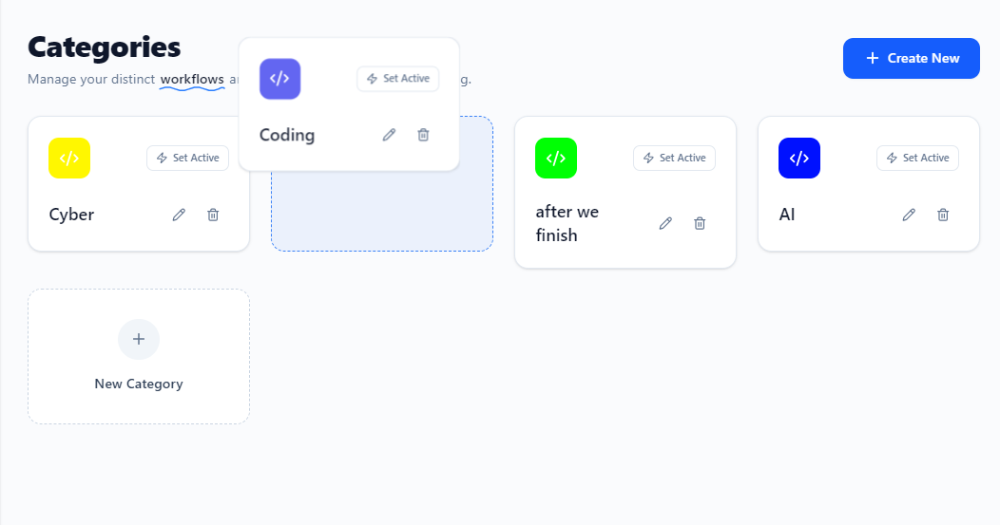

Categories can be reordered using drag-and-drop interactions for easier organization.

---

## ✏️ Edit Category

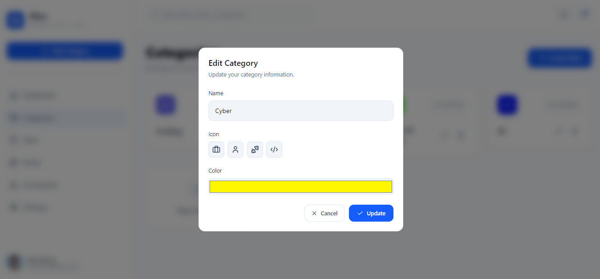

Users can modify existing category information directly from the application.

---

## ✅ Tasks

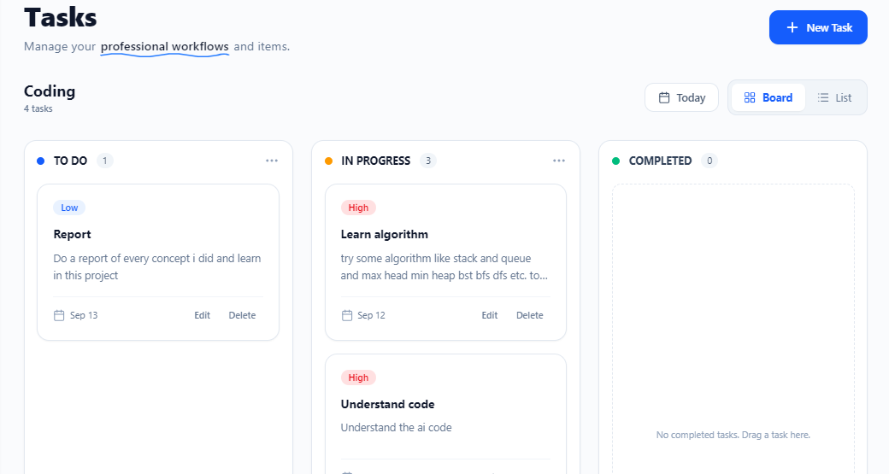

The task management interface allows users to create, organize, and manage their daily tasks.

---

## 🖱️ Drag and Drop Tasks

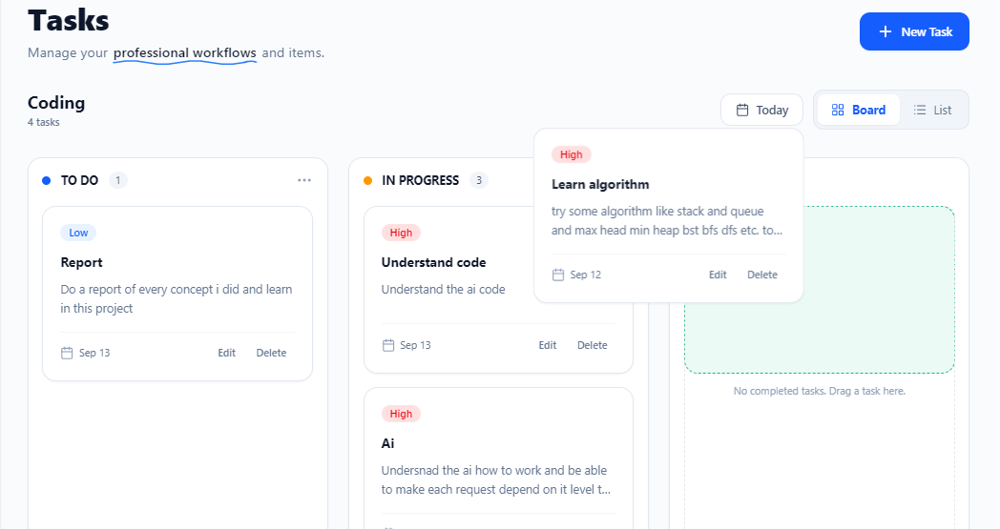

Tasks can be reordered through drag-and-drop functionality.

---

## 📝 Notes

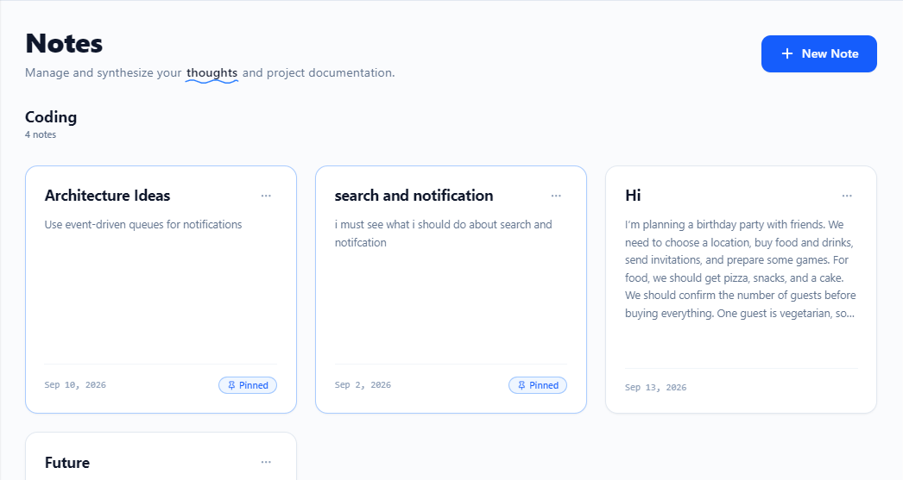

The notes section allows users to store additional information separately from their tasks.

---

## 👤 Profile

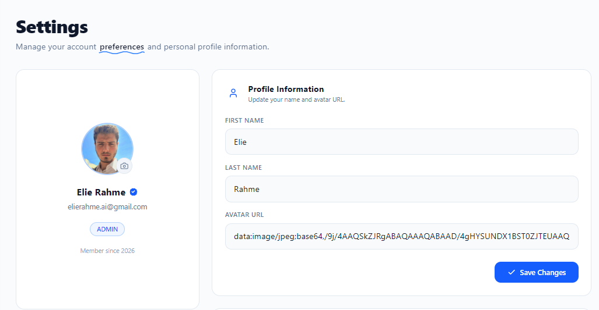

Users can view and manage their account information from the profile section.

---

# 🤖 AI Assistant

The main feature of the platform is the **Elixo AI Assistant**. Users can interact with the application using natural-language commands instead of manually performing every operation.

---

## 💬 AI Assistant

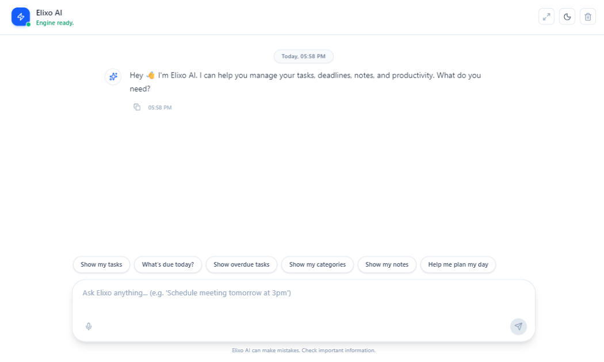

The AI assistant provides a conversational interface for interacting with the productivity system using natural language.

---

## ➕ Create a Task

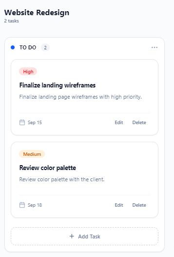

The assistant can understand a natural-language request and create a task with the required information.

---

## 📝 Create a Note

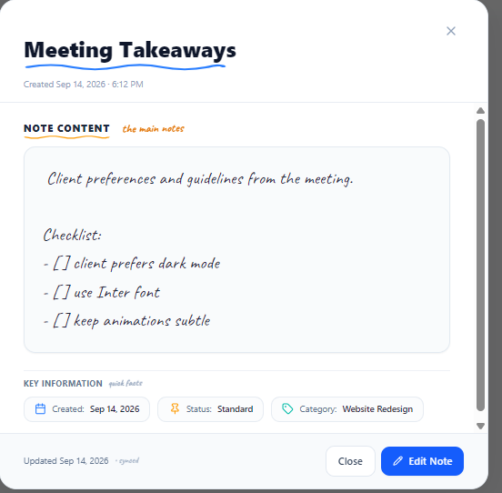

The assistant can identify when the user wants to create a note and keep it separate from task operations.

---

## 🗂️ Create a Category

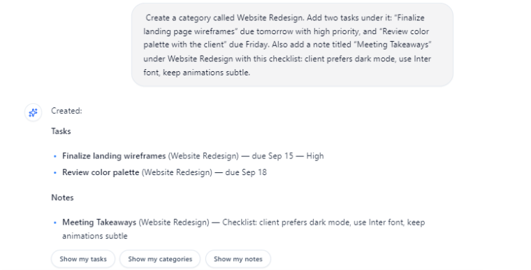

The assistant can process a request containing multiple operations, such as creating a category together with related tasks and notes.

---

## 🗑️ Delete a Category

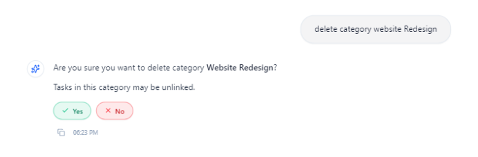

Users can request category deletion through natural language, and the assistant processes the requested operation.

---

## ✅ Deleted Category Result

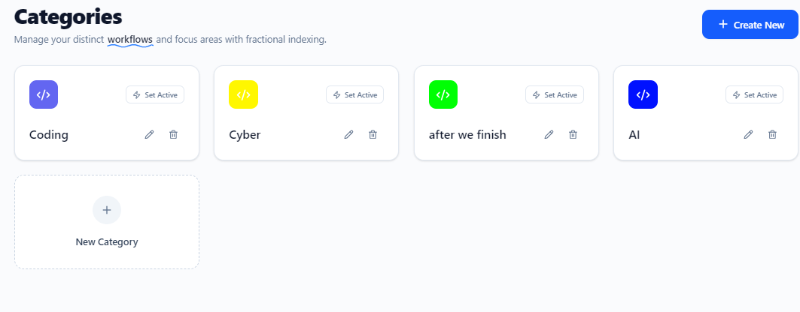

The assistant provides the result after the category deletion operation has been completed.

---

## 📋 Get Tasks

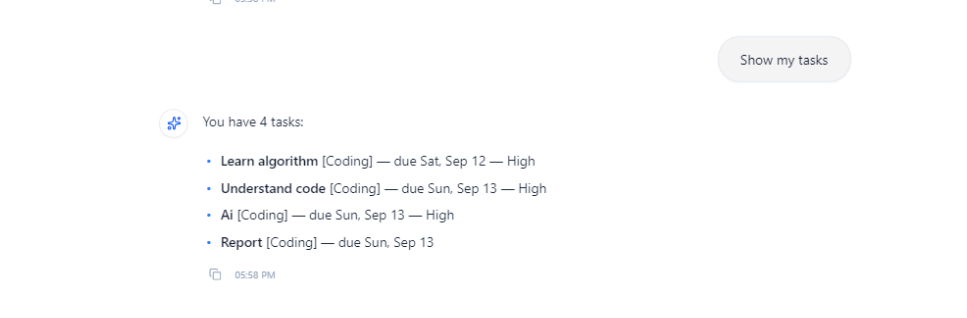

The assistant can retrieve and display tasks based on the user's natural-language request.

---

## 🔽 Update Task Priority

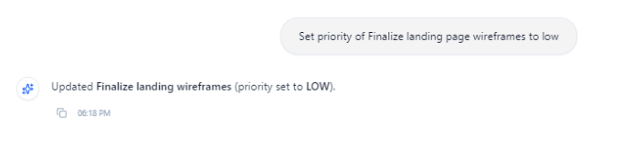

Users can change a task's priority using a natural-language command, such as changing a task to low priority.

---

## 🔄 Update Task Status

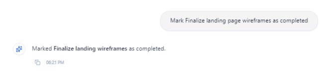

The assistant can update the status of a task, such as changing it to in progress or completed.

---

## 📌 Updated Task

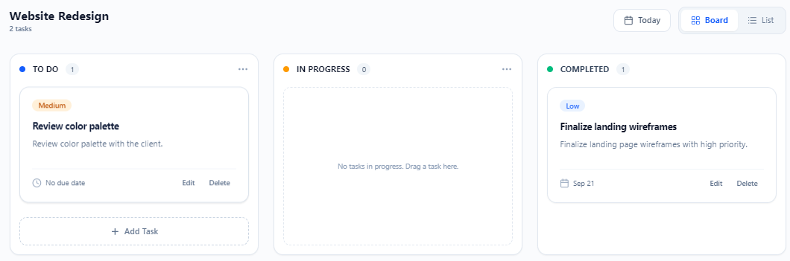

The updated task is displayed after the requested status or task modification has been successfully applied.

---

## 🕐 Update Task Time

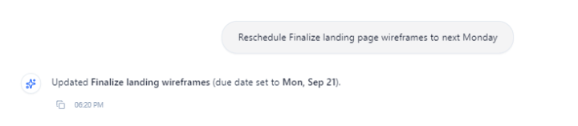

Users can ask the assistant to change the due date or time associated with a task.

---

## 📅 Updated Task Time

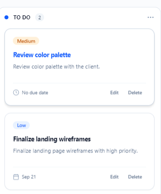

The assistant confirms the updated time and the task reflects the new scheduling information.

---

## 🔽 Updated Priority Result

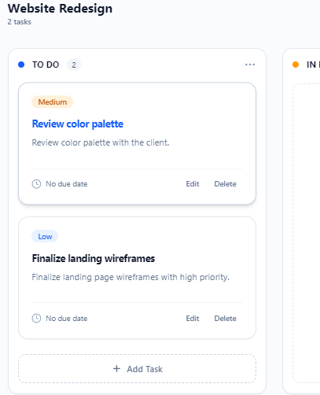

The task displays the updated priority after the AI assistant processes the user's request.

---

## 🧠 AI Assistant Architecture

The AI assistant uses a hybrid approach combining deterministic processing with generative AI.

```text
User Message
      │
      ▼
Input Validation
      │
      ▼
Preprocessing
      │
      ▼
Intent Detection
      │
      ▼
Complexity Analysis
      │
   ┌──┴──┐
   │     │
Simple  Complex
   │     │
   ▼     ▼
Rules  Gemini AI
   │     │
   └──┬──┘
      ▼
Action Validation
      │
      ▼
Application Services
      │
      ▼
Prisma
      │
      ▼
PostgreSQL
```

Simple commands are processed using deterministic backend logic, while more complex natural-language requests can be interpreted using Google Gemini.

---

## 🔐 Authentication & Security

The application includes several security mechanisms:

* JWT-based authentication
* HttpOnly refresh-token cookies
* Password hashing with bcrypt
* Email verification
* OTP-based password recovery
* Google Sign-In
* Cloudflare Turnstile
* Request validation
* Rate limiting
* User-specific data access

---

## 📁 Project Structure

```text
AI Task Management
│
├── frontend/
│   └── Angular application
│
├── backend/
│   ├── controllers/
│   ├── services/
│   ├── middleware/
│   ├── routes/
│   ├── utils/
│   └── Prisma/
│
├── Screen/
│   ├── Dashboard.png
│   ├── Category.png
│   ├── Task.png
│   ├── Note.png
│   ├── Chatbot.png
│   └── ...
│
└── README.md
```

---

## 🎯 Project Goal

The goal of the project is to combine traditional task management with natural-language interaction, allowing users to manage their productivity system in a more intuitive way.

Instead of manually navigating through multiple interfaces, users can communicate with the AI assistant using normal sentences to perform supported productivity operations.

---

## 👨‍💻 Project

**AI Task Management**

A full-stack AI-powered productivity application developed using Angular, Node.js, Express, PostgreSQL, Prisma, Redis, and Google Gemini.
